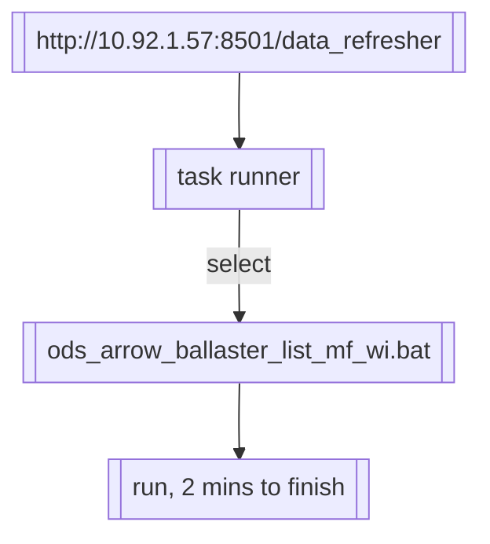

---

author: Samo yan

time: 2023/1/9

title: develop manual of bunge_freight_dashboard_ext

---

  

# 1. ETL

etl script is set automatically schedule to read & write:

>`from` : matlab:\\E:\SugarSync\ANALYSIS FREIGHT ST\Pmax ballaster lists
>`to`    : [BrokerData].[dbo].[ArrowBallasterList]

scheduled at:
`work day starting 11:33 AM geneva time, repeated every 30 minutes for following 12 hours`

or manually run at:



[link to the runner page](http://10.92.1.57:8501/data_refresher)


# 2. Dashboard:


## 2.1 parent region -- region selector:

manual table in dim.

```sql
SELECT TOP (1000) [parent_region],[region]
  FROM [BrokerData].[dbo].[dim_region_map_mf]
``` 


## 2.2 pmax open in select region linear & seasonal total:

* weekly on xaxis
* show value at end point
* automatically change focusing area

## 2.3 total pmax open vs P5TC figure and correlation:

max absolute correlation hit around at 10 days lag.
(after 10 days of pmax open show a pattern, p5tc show an opposite way trend)
corr at around .11 which is pretty low.
potential fixing way is to use more predictors to predict p5tc value.

## 2.4 prediction of pmax open based on machine learning prophet model.

facebook prophet
```
root_mean_squared_error: 9.583665959563687
mean_absolute_percentage_error: 0.06236151615062029
```
 
